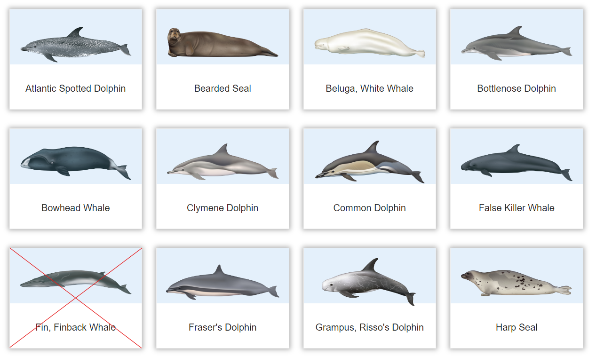
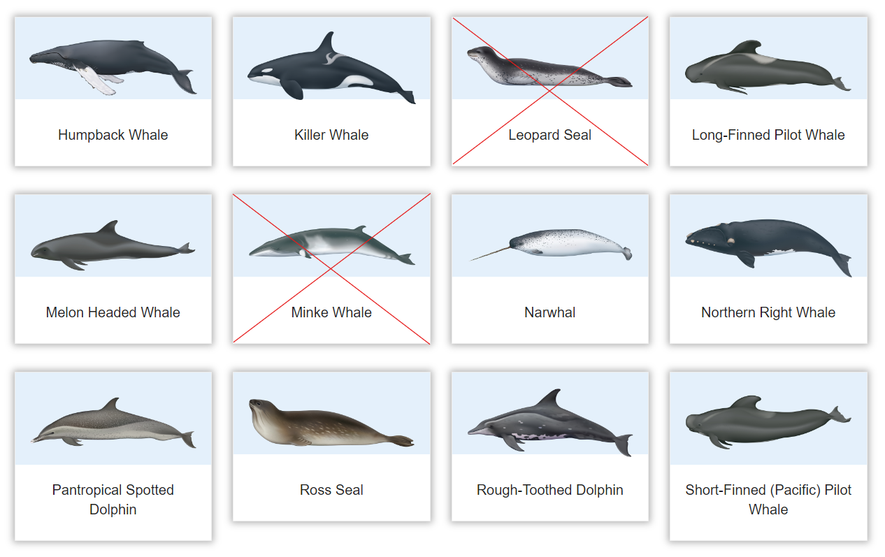
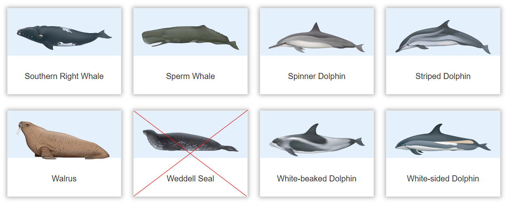

# Marine Mammal Sound Classification

The purpose of this project is to analyze and classify marine mammal sounds.

## Dataset

The dataset selected is the **Best of Watkins Marine Mammal Sound Database**[^1]. This dataset contains 1,694 sound cuts deemed to be of higher sound quality and lower noise from 32 different species.

*Species marked with an :x: were excluded from the study either because they had an extremely small number of instances (<20) or because there was a problem with the format of their `.wav` files.*

---
## Implementation Plan

The implementation plan consists of the following steps:

1. Collection of data and metadata [`1_Scraper.ipynb`](https://github.com/AntigoniMoira/MarineMammalSoundClassification/blob/main/1_Scraper.ipynb)
2. Exploratory data analysis before data preprocesssing [`2_EDA-v1.ipynb`](https://github.com/AntigoniMoira/MarineMammalSoundClassification/blob/main/2_EDA-v1.ipynb)
3. Data Preprocessing (Cleaning and Splitting) [`3_DataPreprocessing.ipynb`](https://github.com/AntigoniMoira/MarineMammalSoundClassification/blob/main/3_DataPreprocessing.ipynb)
4. Exploratory data analysis after data preprocesssing [`4_EDA-v2.ipynb`](https://github.com/AntigoniMoira/MarineMammalSoundClassification/blob/main/4_EDA-v2.ipynb)
5. Handcrafted Features and SVM as baseline for comparison [`5_BaselineSVM.ipynb`](https://github.com/AntigoniMoira/MarineMammalSoundClassification/blob/main/5_BaselineSVM.ipynb)
6. Handcrafted Features and Fully Connected Neural Network [`6_FullyConnectedNN.ipynb`](https://github.com/AntigoniMoira/MarineMammalSoundClassification/blob/main/6_FullyConnectedNN.ipynb)
7. Melgrams/Spectrograms and CNNs [`7_CNN.ipynb`](https://github.com/AntigoniMoira/MarineMammalSoundClassification/blob/main/7_CNN.ipynb)
8. RNNs/LSTMs [`8_LSTM.ipynb`](https://github.com/AntigoniMoira/MarineMammalSoundClassification/blob/main/8_LSTM.ipynb)
9. Audio Transformer [`9_Transformer.ipynb`](https://github.com/AntigoniMoira/MarineMammalSoundClassification/blob/main/9_Transformer.ipynb)
10. Transfer learning [`10_TransferLearning.ipynb`](https://github.com/AntigoniMoira/MarineMammalSoundClassification/blob/main/10_TransferLearning.ipynb)

---

[^1]: [Best of Watkins Marine Mammal Sound Database](https://whoicf2.whoi.edu/science/B/whalesounds/index.cfm)