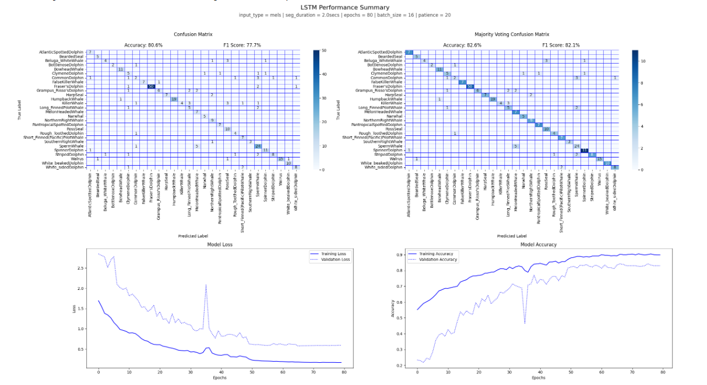

# Marine Mammal Sound Classification

    <b>MSc in Data Science</b>  
    NCSR Demokritos and University of Peloponnese  
    <b>Project for Deep Learning Course</b>  
    June 2024

The purpose of this project is to analyze and classify marine mammal sounds. This involves processing audio recordings of various marine mammal species to identify and differentiate their unique vocalizations.

## 🎧 Dataset

The dataset selected is the **Best of Watkins Marine Mammal Sound Database**[^1]. This dataset contains 1,694 sound cuts deemed to be of higher sound quality and lower noise from 32 different species.

*Species marked with an :x: were excluded from the study either because they had an extremely small number of instances (<20) or because there was a problem with the format of their `.wav` files.*

---
## 🧩 Implementation Plan

The implementation plan consists of the following steps:

1. Collection of data and metadata [`1_Scraper.ipynb`](https://github.com/AntigoniMoira/MarineMammalSoundClassification/blob/main/1_Scraper.ipynb)
2. Exploratory data analysis before data preprocesssing [`2_EDA-step1.ipynb`](https://github.com/AntigoniMoira/MarineMammalSoundClassification/blob/main/2_EDA-step1.ipynb)
3. Data Preprocessing (Cleaning and Splitting) [`3_DataPreprocessing.ipynb`](https://github.com/AntigoniMoira/MarineMammalSoundClassification/blob/main/3_DataPreprocessing.ipynb)
4. Exploratory data analysis after data preprocesssing [`4_EDA-step2.ipynb`](https://github.com/AntigoniMoira/MarineMammalSoundClassification/blob/main/4_EDA-step2.ipynb)
5. Handcrafted Features and SVM as baseline for comparison [`5_BaselineSVM.ipynb`](https://github.com/AntigoniMoira/MarineMammalSoundClassification/blob/main/5_BaselineSVM.ipynb)
6. Handcrafted Features and Fully Connected Neural Network [`6_FullyConnectedNN.ipynb`](https://github.com/AntigoniMoira/MarineMammalSoundClassification/blob/main/6_FullyConnectedNN.ipynb)
7. Melgrams/Spectrograms and CNNs [`7_CNN.ipynb`](https://github.com/AntigoniMoira/MarineMammalSoundClassification/blob/main/7_CNN.ipynb)
8. RNNs/LSTMs [`8_LSTM.ipynb`](https://github.com/AntigoniMoira/MarineMammalSoundClassification/blob/main/8_LSTM.ipynb)
9. Transfer learning [`9_TransferLearning.ipynb`](https://github.com/AntigoniMoira/MarineMammalSoundClassification/blob/main/9_TransferLearning.ipynb)

---

## 🧹 Preprocessing

The dataset consisted of **1,583 audio samples** across **28 marine mammal classes**. The following preprocessing steps were applied:

- **Data Cleaning**:
  - Excluded class folders with fewer than 20 instances.
  - Removed audio samples containing sounds from multiple species.

- **Mel-Spectrogram Generation**:
  - **Sample Rate Standardization**: All `.wav` files were resampled to 22,050 Hz.
  - **Segmentation**: Audio was split into 2-second segments.
  - **Feature Extraction**: Used the [`librosa`](https://github.com/librosa/librosa) library to compute mel-spectrograms (melgrams) from each segment and [`pyAudioAnalysis`](https://github.com/tyiannak/pyAudioAnalysis) library to calculate the handcrafted features.

- **Data Splitting**:
  - 80% Training
  - 10% Validation
  - 10% Testing

## 🧪 Results

Multiple machine learning and deep learning models were trained and evaluated on the mel-spectrogram data:

| Model                               | Accuracy   | F1 (Macro) |
|-------------------------------------|------------|------------|
| **SVM**                             | 73.3%      | 72.0%      |
| **Fully Connected Neural Network**  | 75.8%      | 73.1%      |
| **Convolutional Neural Network (CNN)** | 80.8%   | 81.2%      |
| **Long Short-Term Memory (LSTM)**   | **82.6%**  | **82.1%**  |
| **MobileNetV2 (Transfer Learning)** | 82.0%      | 80.0%      |

> 🏆 **The best overall performance was achieved using an LSTM-based architecture:**
> 1. **LSTM Layer**: 128 units — processes sequences and returns full sequences.
2. **Dropout Layer**: 10% dropout rate to reduce overfitting.
3. **LSTM Layer**: 128 units — processes output of the first LSTM.
4. **Dropout Layer**: 10% dropout rate.
5. **Dense Output Layer**: Softmax activation over `num_classes` categories.
6. **Compilation**: Optimized with Adam, using categorical cross-entropy loss and accuracy as the evaluation metric.

### 📊 Visual Results

The best model's performance is illustrated below:

### 📌 Notes

- All models were implemented using **Scikit-learn** and **TensorFlow/Keras**.
- Visualizations were created using **Matplotlib** and **Seaborn**.

[^1]: [Best of Watkins Marine Mammal Sound Database](https://whoicf2.whoi.edu/science/B/whalesounds/index.cfm)
